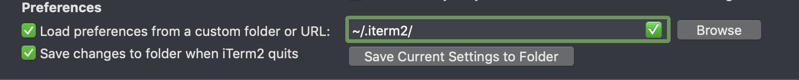

# setup-osx

macOS のセットアップ手順

## ブラウザ

* Google Chrome
* FireFox

## パッケージマネージャ

### brew

```sh
/usr/bin/ruby -e "$(curl -fsSL https://raw.githubusercontent.com/Homebrew/install/master/install)"
```

### gofish

```sh
curl -fsSL https://raw.githubusercontent.com/fishworks/gofish/master/scripts/install.sh | bash
```

## python

```sh
sudo easy_install pip
```

## ruby

```sh
brew install rbenv
```

## フォント

### source-han-code-jp

```sh
curl -L https://github.com/adobe-fonts/source-han-code-jp/archive/2.000R.tar.gz | tar zx
mv source-han-code-jp-2.000R/OTC/SourceHanCodeJP.ttc ~/library/fonts
rm -r source-han-code-jp-2.000R
```

### powerline

```sh
git clone https://github.com/powerline/fonts.git
cd fonts
./install.sh
```

## fish shell

[fish shellセットアップ手順](./SETUP_FISH_SHELL.md)

## terminal

### iTerm2

<https://www.iterm2.com/downloads.html>

```sh
mkdir ~/.iterm2/
```



`com.googlecode.iterm2.plist` ファイルを置き換える。

### colorrc

`.colorrc` の内容を `~/.colorrc` ファイルに保存。

## git user

```sh
git config --global user.name=yoskeoka
git config --global user.email=y.okamoto@gemcook.com
```

## エディタ

### Visual Studio Code

<https://code.visualstudio.com/Download>

ダウンロードして、zip解凍し `Visual Studio Code.app` をアプリケーションに追加

CMD+SHIFT+P でコマンドパレットを開く

`Shell Command: Install 'code' command in PATH`

## command line tools

```sh
brew install jid jo jq colordiff ghq
```

```sh
git config --global ghq.root '~/src'
```

```sh
pip install awscli --user
```

## Go言語

[Go言語セットアップ手順](./SETUP_GOLANG.md)

## Docker & Kubernetes

[Docker for mac](https://docs.docker.com/docker-for-mac/install/)

```sh
brew install kubectx
gofish install helm
```

## GUI tools

```sh
brew cask install copyq
```

## mac setting

⌘+SHIFT+3 or ⌘+SHIFT+3 のスクリーンショットの保存先変更。

```sh
defaults write com.apple.screencapture location ~/Pictures/
killall SystemUIServer
```